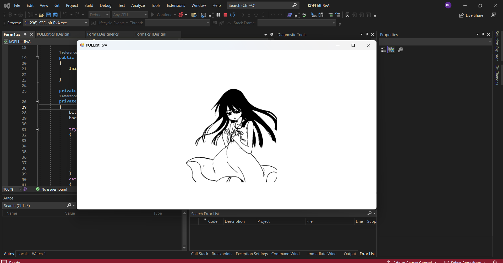

# KOELbit RvA

So, KOELbit RvA (Ransomware vs Antivirus) is a project to test the detection and removing (anti-malware) Ransomware. 
This project is still under development and maintained by me. If you have any recommendation please create a new issue or pr or directly reach me here [raselm@duck.com](raselm@duck.com) 

# About the project
## Tribute or something!
Well, yes. Who? ikigai~ Kowaidesu~
## Why Encryption model?
I have already mentioned, this RvA project is to test the Antivirus only. So no unethical reason here to make this.
## What about the Antivirus?
Well, its first target to break the chain protection of any Antivirus, specially Windows Defender(though it's not still made for that).
## 

## Safety & Privacy
You shouldn't test this on your local computer though before compiling you have to set the decryption password for security purpose, but still there is a chance that your files can be lost by compression broken chain. So I recommend to use or test it on Virtualbox. No data will be sent anywhere, you can review the codebase. Only encryption and decryption on local.

## Dev and contributing

Built with [C#(.NET)](https://dotnet.microsoft.com/en-us/)

Dev and compile works on Linux and Windows. You will need [dotnet Framework](https://dotnet.microsoft.com/en-us/download/dotnet-framework) to run this app.

Any contribution or suggestion is accepted. Feel free to create any report for issues or app crashes. You can also use the report link provided in the application menu to create a crash report or contact me through the link provided.
Pull requests are accepted.

### Developing
1. `editing mainForm`
1. `adding otherForms as required.`
1. `Adding cryptography logic in Form1.`
1. `Adding more extensions for file detection`.
1. `Renaming the (.koel) extension in setting to your extension.`

## Running the App

### Executables

You can build your own executables from the latest source by running one of the commands below. Executables(with ConfuserX) can be found [here](https://github.com/raselmandol/KOELbit-RvA/tree/main/Release). ConfuserEx Documentation [here](https://yck1509.github.io/ConfuserEx/).

### Compiling from source
To import and compile the project in Visual Studio, you can follow these steps:

Clone the repository: Start by cloning the GitHub repository to your local machine. You can use a Git client or the command line to do this. Navigate to your desired directory and run the following command:

 `$ git clone https://github.com/raselmandol/KOELbit-RvA`

Open the project in Visual Studio: Launch Visual Studio and select "Open a project or solution" from the startup screen. Navigate to the directory where you cloned the repository and select the project file (typically with a .csproj extension). Click "Open" to load the project into Visual Studio.

Restore NuGet packages: The project relies on some external NuGet packages, you'll need to restore them. In Visual Studio, right-click on the project in the Solution Explorer and select "Restore NuGet Packages." This will download and install the required packages defined in the project's dependencies.

Build the project: Once the packages are restored, you can build the project. Go to the "Build" menu and select "Build Solution" (or press Ctrl + Shift + B). This will compile the source code and generate the executable or library files. You can find the executable on Debug folder.

For building with installer project, find the documentation [here](https://learn.microsoft.com/en-us/visualstudio/deployment/installer-projects-net-core?view=vs-2022).

## Author

- [@raselmandol](https://www.github.com/raselmandol)

